<!-- Cabeçalho -->

  

  

  
  

---

## 👨‍💻 Sobre mim

- 🏥 Estagiário de **Analista de Sistemas** no **HCFAMEMA**, trabalhando com **.NET e C#**
- 🎓 Cursando **Tecnologia da Informação** na **Universidade de Marília**
- 🌱 Estudando **Web APIs com .NET**, **Entity Framework Core** e **Clean Architecture**
- 🛠️ Já passei por **suporte técnico** e **help desk em e-commerce (Shopify)**, com relatórios via SQL
- 📍 Marília - SP

---

## 🧰 Tecnologias

**Back-end**

  
  
  
  

**Banco de dados**

  
  

**Ferramentas**

  
  
  
  
  

---

## 🚀 Projetos

| Projeto | O que é |
|---|---|
| [**PrimeiraApi**](https://github.com/Davi-D-Lucca/Estudos/tree/main/WebApi) | Web API de funcionários com upload de foto, JWT, versionamento, AutoMapper e Migrations |
| [**EmprestimoLivroApi**](https://github.com/Davi-D-Lucca/Estudos/tree/main/EmprestimoLivroApi) | API de empréstimo de livros em Clean Architecture, com relacionamentos no EF Core *(em andamento)* |

  

---

## 📊 Estatísticas

  
  

  

<!-- Rodapé -->

  

